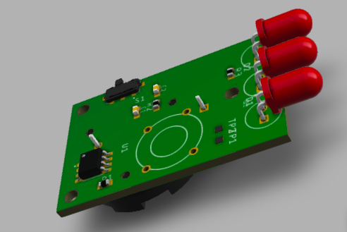

WardRobe CLOSER
===============

Detect open doors and Bip
--------------------------

### Arduino
Usb connection 
arduino framework 

### Attiny84
SPI Through BusPirate 
arduino framework 

Consumption
-----------
On Attiny25 @ 1Mhz  
Sleeping: 6,6µA  
Beeping : 1.2mA  

Expectation on Sony CR-2032 - Batterie CR2032 - Li - 220 mAh  
10 Mn Beeping daily  

Tips
----
`./serial` launch serial console through buspirate  
`pio run -t fuses` set the fuses  
`pio run -t upload -e release|uno` upload  a specific release version without serial debug  
`pio platform update --dry-run` check for updates  

